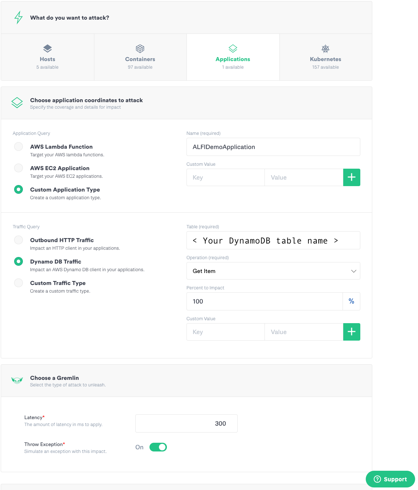
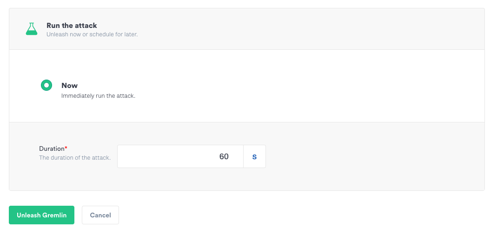

# alfi-dynamodb

## Setup

1. Set the following environment variables:

    | Key | Value|
    | ---- | ---- |
    | GREMLIN_ALFI_ENABLED | true |
    | GREMLIN_TEAM_CERTIFICATE_OR_FILE | file:///path/to/.gremlin/cert.pem |
    | GREMLIN_TEAM_PRIVATE_KEY_OR_FILE | file:///path/to/.gremlin/priv.pem |
    | GREMLIN_TEAM_ID | < Your team ID > |
    | AWS_ACCESS_KEY_ID | < Your key ID > | 
    | AWS_SECRET_ACCESS_KEY | < Your secret key > |
    | AWS_REGION | < Your AWS region |
    | DYNAMO_DB_TABLE | < Your DynamoDB table name > |

2. Create a table in DynamoDB with an `id` of type `String` as the primary partition key.

3. Add at least one record to the DynamoDb table just created.

2. Launch alfi-dynamodb application locally from the root of this project.

    `./mvnw spring-boot:run`        

## Usage

1. Test the application (locally) `curl http://localhost:8080/{id}`

2. Setup an ALFI Attack in Gremlin like this:



3. Set the Duration then click the "Unleash Gremlin" button



4. Test this application endpoint again.
    `curl http://localhost:8080/{id}`
    
You should a stack trace similar to the following

```text
2020-05-29 11:38:17.972  INFO 55726 --- [nio-8080-exec-4] c.e.a.persistence.GetItemRequester       : Querying DynamoDB for item with ID 2ZYFJ3GM2N...
2020-05-29 11:38:18.078  INFO 55726 --- [nio-8080-exec-4] c.g.aws.GremlinDynamoRequestInterceptor  : Gremlin will inject failure (fail=true, latency=300ms) into DynamoDB Client
2020-05-29 11:38:18.381 ERROR 55726 --- [nio-8080-exec-4] c.e.a.persistence.GetItemRequester       : Fault injected by Gremlin (Service: null; Status Code: 0; Error Code: null; Request ID: null; Proxy: null)
2020-05-29 11:38:18.382  INFO 55726 --- [nio-8080-exec-4] c.e.a.persistence.GetItemRequester       : Call to DynamoDB took 409 milliseconds.
2020-05-29 11:38:18.384 ERROR 55726 --- [nio-8080-exec-4] o.a.c.c.C.[.[.[/].[dispatcherServlet]    : Servlet.service() for servlet [dispatcherServlet] in context with path [] threw exception [Request processing failed; nested exception is com.amazonaws.services.dynamodbv2.model.AmazonDynamoDBException: Fault injected by Gremlin (Service: null; Status Code: 0; Error Code: null; Request ID: null; Proxy: null)] with root cause

com.amazonaws.services.dynamodbv2.model.AmazonDynamoDBException: Fault injected by Gremlin (Service: null; Status Code: 0; Error Code: null; Request ID: null; Proxy: null)
	at com.gremlin.aws.GremlinDynamoRequestInterceptor.beforeRequest(GremlinDynamoRequestInterceptor.java:143) ~[alfi-aws-dynamodb-client-0.7.3.jar:na]
	at com.amazonaws.http.AmazonHttpClient$RequestExecutor.runBeforeRequestHandlers(AmazonHttpClient.java:841) ~[aws-java-sdk-core-1.11.791.jar:na]
	at com.amazonaws.http.AmazonHttpClient$RequestExecutor.doExecute(AmazonHttpClient.java:783) ~[aws-java-sdk-core-1.11.791.jar:na]
	at com.amazonaws.http.AmazonHttpClient$RequestExecutor.executeWithTimer(AmazonHttpClient.java:770) ~[aws-java-sdk-core-1.11.791.jar:na]
	at com.amazonaws.http.AmazonHttpClient$RequestExecutor.execute(AmazonHttpClient.java:744) ~[aws-java-sdk-core-1.11.791.jar:na]
	at com.amazonaws.http.AmazonHttpClient$RequestExecutor.access$500(AmazonHttpClient.java:704) ~[aws-java-sdk-core-1.11.791.jar:na]
	at com.amazonaws.http.AmazonHttpClient$RequestExecutionBuilderImpl.execute(AmazonHttpClient.java:686) ~[aws-java-sdk-core-1.11.791.jar:na]
	at com.amazonaws.http.AmazonHttpClient.execute(AmazonHttpClient.java:550) ~[aws-java-sdk-core-1.11.791.jar:na]
	at com.amazonaws.http.AmazonHttpClient.execute(AmazonHttpClient.java:530) ~[aws-java-sdk-core-1.11.791.jar:na]
	at com.amazonaws.services.dynamodbv2.AmazonDynamoDBClient.doInvoke(AmazonDynamoDBClient.java:5136) ~[aws-java-sdk-dynamodb-1.11.791.jar:na]
	at com.amazonaws.services.dynamodbv2.AmazonDynamoDBClient.invoke(AmazonDynamoDBClient.java:5103) ~[aws-java-sdk-dynamodb-1.11.791.jar:na]
	at com.amazonaws.services.dynamodbv2.AmazonDynamoDBClient.executeGetItem(AmazonDynamoDBClient.java:2216) ~[aws-java-sdk-dynamodb-1.11.791.jar:na]
	at com.amazonaws.services.dynamodbv2.AmazonDynamoDBClient.getItem(AmazonDynamoDBClient.java:2182) ~[aws-java-sdk-dynamodb-1.11.791.jar:na]
	at com.example.alfidynamodb.persistence.GetItemRequester.getItem(GetItemRequester.java:36) ~[classes/:na]
	at com.example.alfidynamodb.controller.Main.fetchItems(Main.java:32) ~[classes/:na]
	at java.base/jdk.internal.reflect.NativeMethodAccessorImpl.invoke0(Native Method) ~[na:na]
	at java.base/jdk.internal.reflect.NativeMethodAccessorImpl.invoke(NativeMethodAccessorImpl.java:62) ~[na:na]
	at java.base/jdk.internal.reflect.DelegatingMethodAccessorImpl.invoke(DelegatingMethodAccessorImpl.java:43) ~[na:na]
	at java.base/java.lang.reflect.Method.invoke(Method.java:566) ~[na:na]
	at org.springframework.web.method.support.InvocableHandlerMethod.doInvoke(InvocableHandlerMethod.java:190) ~[spring-web-5.2.6.RELEASE.jar:5.2.6.RELEASE]
	at org.springframework.web.method.support.InvocableHandlerMethod.invokeForRequest(InvocableHandlerMethod.java:138) ~[spring-web-5.2.6.RELEASE.jar:5.2.6.RELEASE]
	at org.springframework.web.servlet.mvc.method.annotation.ServletInvocableHandlerMethod.invokeAndHandle(ServletInvocableHandlerMethod.java:105) ~[spring-webmvc-5.2.6.RELEASE.jar:5.2.6.RELEASE]
	at org.springframework.web.servlet.mvc.method.annotation.RequestMappingHandlerAdapter.invokeHandlerMethod(RequestMappingHandlerAdapter.java:879) ~[spring-webmvc-5.2.6.RELEASE.jar:5.2.6.RELEASE]
	at org.springframework.web.servlet.mvc.method.annotation.RequestMappingHandlerAdapter.handleInternal(RequestMappingHandlerAdapter.java:793) ~[spring-webmvc-5.2.6.RELEASE.jar:5.2.6.RELEASE]
	at org.springframework.web.servlet.mvc.method.AbstractHandlerMethodAdapter.handle(AbstractHandlerMethodAdapter.java:87) ~[spring-webmvc-5.2.6.RELEASE.jar:5.2.6.RELEASE]
	at org.springframework.web.servlet.DispatcherServlet.doDispatch(DispatcherServlet.java:1040) ~[spring-webmvc-5.2.6.RELEASE.jar:5.2.6.RELEASE]
	at org.springframework.web.servlet.DispatcherServlet.doService(DispatcherServlet.java:943) ~[spring-webmvc-5.2.6.RELEASE.jar:5.2.6.RELEASE]
	at org.springframework.web.servlet.FrameworkServlet.processRequest(FrameworkServlet.java:1006) ~[spring-webmvc-5.2.6.RELEASE.jar:5.2.6.RELEASE]
	at org.springframework.web.servlet.FrameworkServlet.doGet(FrameworkServlet.java:898) ~[spring-webmvc-5.2.6.RELEASE.jar:5.2.6.RELEASE]
	at javax.servlet.http.HttpServlet.service(HttpServlet.java:634) ~[tomcat-embed-core-9.0.35.jar:9.0.35]
	at org.springframework.web.servlet.FrameworkServlet.service(FrameworkServlet.java:883) ~[spring-webmvc-5.2.6.RELEASE.jar:5.2.6.RELEASE]
	at javax.servlet.http.HttpServlet.service(HttpServlet.java:741) ~[tomcat-embed-core-9.0.35.jar:9.0.35]
	at org.apache.catalina.core.ApplicationFilterChain.internalDoFilter(ApplicationFilterChain.java:231) ~[tomcat-embed-core-9.0.35.jar:9.0.35]
	at org.apache.catalina.core.ApplicationFilterChain.doFilter(ApplicationFilterChain.java:166) ~[tomcat-embed-core-9.0.35.jar:9.0.35]
	at org.apache.tomcat.websocket.server.WsFilter.doFilter(WsFilter.java:53) ~[tomcat-embed-websocket-9.0.35.jar:9.0.35]
	at org.apache.catalina.core.ApplicationFilterChain.internalDoFilter(ApplicationFilterChain.java:193) ~[tomcat-embed-core-9.0.35.jar:9.0.35]
	at org.apache.catalina.core.ApplicationFilterChain.doFilter(ApplicationFilterChain.java:166) ~[tomcat-embed-core-9.0.35.jar:9.0.35]
	at org.springframework.web.filter.RequestContextFilter.doFilterInternal(RequestContextFilter.java:100) ~[spring-web-5.2.6.RELEASE.jar:5.2.6.RELEASE]
	at org.springframework.web.filter.OncePerRequestFilter.doFilter(OncePerRequestFilter.java:119) ~[spring-web-5.2.6.RELEASE.jar:5.2.6.RELEASE]
	at org.apache.catalina.core.ApplicationFilterChain.internalDoFilter(ApplicationFilterChain.java:193) ~[tomcat-embed-core-9.0.35.jar:9.0.35]
	at org.apache.catalina.core.ApplicationFilterChain.doFilter(ApplicationFilterChain.java:166) ~[tomcat-embed-core-9.0.35.jar:9.0.35]
	at org.springframework.web.filter.FormContentFilter.doFilterInternal(FormContentFilter.java:93) ~[spring-web-5.2.6.RELEASE.jar:5.2.6.RELEASE]
	at org.springframework.web.filter.OncePerRequestFilter.doFilter(OncePerRequestFilter.java:119) ~[spring-web-5.2.6.RELEASE.jar:5.2.6.RELEASE]
	at org.apache.catalina.core.ApplicationFilterChain.internalDoFilter(ApplicationFilterChain.java:193) ~[tomcat-embed-core-9.0.35.jar:9.0.35]
	at org.apache.catalina.core.ApplicationFilterChain.doFilter(ApplicationFilterChain.java:166) ~[tomcat-embed-core-9.0.35.jar:9.0.35]
	at org.springframework.web.filter.CharacterEncodingFilter.doFilterInternal(CharacterEncodingFilter.java:201) ~[spring-web-5.2.6.RELEASE.jar:5.2.6.RELEASE]
	at org.springframework.web.filter.OncePerRequestFilter.doFilter(OncePerRequestFilter.java:119) ~[spring-web-5.2.6.RELEASE.jar:5.2.6.RELEASE]
	at org.apache.catalina.core.ApplicationFilterChain.internalDoFilter(ApplicationFilterChain.java:193) ~[tomcat-embed-core-9.0.35.jar:9.0.35]
	at org.apache.catalina.core.ApplicationFilterChain.doFilter(ApplicationFilterChain.java:166) ~[tomcat-embed-core-9.0.35.jar:9.0.35]
	at org.apache.catalina.core.StandardWrapperValve.invoke(StandardWrapperValve.java:202) ~[tomcat-embed-core-9.0.35.jar:9.0.35]
	at org.apache.catalina.core.StandardContextValve.invoke(StandardContextValve.java:96) ~[tomcat-embed-core-9.0.35.jar:9.0.35]
	at org.apache.catalina.authenticator.AuthenticatorBase.invoke(AuthenticatorBase.java:541) ~[tomcat-embed-core-9.0.35.jar:9.0.35]
	at org.apache.catalina.core.StandardHostValve.invoke(StandardHostValve.java:139) ~[tomcat-embed-core-9.0.35.jar:9.0.35]
	at org.apache.catalina.valves.ErrorReportValve.invoke(ErrorReportValve.java:92) ~[tomcat-embed-core-9.0.35.jar:9.0.35]
	at org.apache.catalina.core.StandardEngineValve.invoke(StandardEngineValve.java:74) ~[tomcat-embed-core-9.0.35.jar:9.0.35]
	at org.apache.catalina.connector.CoyoteAdapter.service(CoyoteAdapter.java:343) ~[tomcat-embed-core-9.0.35.jar:9.0.35]
	at org.apache.coyote.http11.Http11Processor.service(Http11Processor.java:373) ~[tomcat-embed-core-9.0.35.jar:9.0.35]
	at org.apache.coyote.AbstractProcessorLight.process(AbstractProcessorLight.java:65) ~[tomcat-embed-core-9.0.35.jar:9.0.35]
	at org.apache.coyote.AbstractProtocol$ConnectionHandler.process(AbstractProtocol.java:868) ~[tomcat-embed-core-9.0.35.jar:9.0.35]
	at org.apache.tomcat.util.net.NioEndpoint$SocketProcessor.doRun(NioEndpoint.java:1590) ~[tomcat-embed-core-9.0.35.jar:9.0.35]
	at org.apache.tomcat.util.net.SocketProcessorBase.run(SocketProcessorBase.java:49) ~[tomcat-embed-core-9.0.35.jar:9.0.35]
	at java.base/java.util.concurrent.ThreadPoolExecutor.runWorker(ThreadPoolExecutor.java:1128) ~[na:na]
	at java.base/java.util.concurrent.ThreadPoolExecutor$Worker.run(ThreadPoolExecutor.java:628) ~[na:na]
	at org.apache.tomcat.util.threads.TaskThread$WrappingRunnable.run(TaskThread.java:61) ~[tomcat-embed-core-9.0.35.jar:9.0.35]
	at java.base/java.lang.Thread.run(Thread.java:834) ~[na:na]

```


